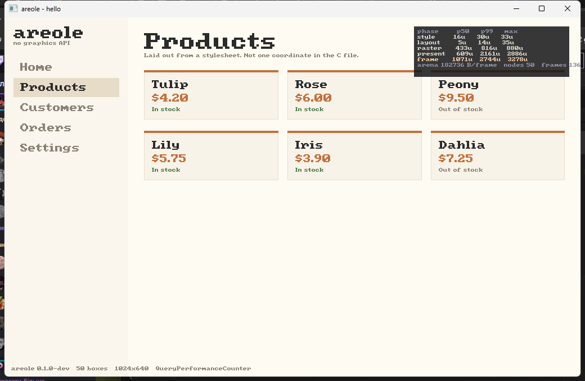

# areole

**A GUI library in strict C89 that uses no graphics API.**

No Direct2D. No OpenGL. No Vulkan. No SDL. No GTK. `areole` rasterizes every
pixel itself and hands the finished buffer to the operating system in a single
blit. Layout is written in **real CSS**, parsed once at startup.



Every rectangle above came out of a stylesheet. The example that draws it does
not contain a single coordinate.

```c
ar_stylesheet(ui,
    ".rail    { width:220px; display:flex; flex-direction:column; padding:16px; gap:2px; }"
    ".nav     { padding:9px 12px; font-size:16px; color:#8a8175; }"
    ".nav:hover { background:#f0e9db; color:#2b2b2b; }");

ar_begin(ui, "div.rail");
    for (i = 0; i < 5; ++i)
        if (ar_button(ui, "div.nav", pages[i])) selected = i;
ar_end(ui);
```

## Why

There are excellent immediate mode GUI libraries. None of them is this one.

| | C89 | zero deps | software blit | declarative flex layout |
| --- | :-: | :-: | :-: | :-: |
| [Nuklear](https://github.com/Immediate-Mode-UI/Nuklear) | yes | yes | yes | **no** — manual rows and columns |
| [Clay](https://github.com/nicbarker/clay) | **no** — C99 compound literals | yes | **no** — emits commands only | yes |
| [Dear ImGui](https://github.com/ocornut/imgui) | **no** — C++ | no | **no** — GPU only | no |
| [LVGL](https://github.com/lvgl/lvgl) | **no** — C99 | libc | yes | yes |
| [luigi](https://github.com/nakst/luigi) | **no** — C99 | yes | yes | **no** — retained, manual |
| **areole** | **yes** | **yes** | **yes** | **yes** |

## Two invariants

Everything else is negotiable.

**No heap allocation after `ar_init`.** The caller hands areole one block and
that is all it ever gets. The example makes exactly one allocation, and the
operating system did it before `main` ran:

```c
static unsigned char memory[AR_MEM(512)];
ar_ctx *ui = ar_init(memory, sizeof memory);
```

**No floating point in the layout or raster hot path.** Flex slack is
distributed in integers and the rasterizer never sees a float. A Pentium III
has an FPU; it is still slower and less predictable than the integer unit, and
predictability is what makes p99 frame time equal p50.

## Numbers

areole measures itself. The phases are reported separately because a single
frame time hides the one thing worth knowing on old hardware: whether the cost
is the rasterizer or the blit. Those have entirely different fixes.

areole repaints only what changed, so an interface has two costs and both
matter. The shipped `dashboard` example -- rail, nav, six cards, 49 boxes, 182
glyphs -- at 1024x768 on a Ryzen 7 8840HS:

| | |
| --- | --: |
| Steady frame, cursor drifting | **8.6 us** |
| p99 | 20.5 us |
| Full repaint, everything invalidated | 233 us |
| Heap allocations after init | **0** |

The first number is what the machine actually pays, because most frames change
nothing and paint nothing. The second is the ceiling, measured with
`ar_bench --full-repaint`, and it is the one the Pentium II budget is checked
against: a machine that cannot afford its worst frame does not have a working
interface, it has one that stutters.

Per unit, which is what scales to a slower machine:

| | |
| --- | --: |
| Opaque fill | **0.22 ns/pixel** |
| Full-surface write, uncached | 0.20 ns/pixel |
| Glyph | **47 ns** |
| Box, style and layout | **138 ns** |

The glyph figure used to be the bad one. The blitter tied with GDI on text
while beating it three to ten times on everything else, which is how we learned
it was about fifteen times slower than it should be; rewriting it to work in
spans rather than per bit made it 10.7x faster and turned that tie into 9.3x.

Averages are not reported. A UI that is smooth apart from one stall every two
seconds has an excellent average and is unusable.

Every scene, every percentile and the full derivation:
**[docs/PERFORMANCE.md](docs/PERFORMANCE.md)**, which is generated from measured
JSON and checked by CI so a published number cannot drift from a measured one.

### What the style cache bought

Style resolution was 50 to 89% of every tree-driven frame, and grew linearly
with the size of the stylesheet because every box was matched against every
rule. It is now keyed on the tuple that decides the answer -- tag, class, id and
state -- so a thousand cards sharing a class resolve once.

| rules in the sheet | before | after |
| --- | --: | --: |
| 13 | 108 us | **51 us** |
| 103 | 239 us | **78 us** |
| 253 | 416 us | **80 us** |

The ratios matter less than the shape: near-flat where it used to be linear.
That is what makes a real user-agent stylesheet affordable, and it is why the
cache was built before the cascade rather than alongside it.

Sixty-four entries hold one style per distinct selector-and-state combination,
not one per box. Every scene reports a hit rate of 1.000 except the dashboard at
0.996, and that rate is published per scene rather than assumed -- a table too
small does not fail, it quietly goes back to scanning every rule for every box.

### What damage tracking bought

Every scene in the library, 0.1.1 against 0.1.2, same machine:

| scene | before | after | |
| --- | --: | --: | --: |
| `dashboard` | 344 us | 12 us | **28.2x** |
| `deep_60` | 67 us | 11 us | **6.0x** |
| `flat_100` | 74 us | 13 us | **5.6x** |
| `scroll_10k` | 707 us | 173 us | **4.1x** |
| `flat_1k` | 327 us | 157 us | **2.1x** |
| `table_1k_rows` | 2883 us | 1543 us | **1.9x** |

Twenty-six of twenty-eight scenes improved. `many_short_labels` is 1.10x
*slower* and stays that way: 240 labels means hashing 240 strings, and text has
to be hashed by content rather than by pointer because formatting a label into
a reused buffer every frame is the ordinary way to write an immediate mode
interface, and that leaves the pointer identical while the pixels differ.

The damaged region is a list of up to eight rectangles rather than one merged
box, and that is not a refinement. Two boxes in opposite corners with one
changing -- a status bar and a clock -- merge into a whole-window rectangle:
480,000 pixels presented to update 768. On a Pentium II that is 7.68 ms against
0.01 ms, 46% of the frame budget. Keeping the rectangles separate costs fifty
lines and presents exactly the 768.

The price is `arena_churn`, a scene that rebuilds four thousand boxes every
frame, which is 25% slower. That is a shape no real interface has, traded
against one every interface has.

## Style

Real CSS, a subset of it. Selectors carry several classes and combinators:

```css
.card.selected     { background: #2b7; }   /* both classes */
.page .card        { padding: 12px; }      /* a descendant */
#root > .card      { margin: 4px; }        /* a direct child, not a grandchild */
.row + .row        { border-top-width: 1px; }
```

`color` and `font-size` inherit, including through a box that only inherited
them, so a stylesheet states them once rather than on every rule.

Resolution is cached on the selector alone — tag, classes, id and state — which
is why it is fast. Inheritance and combinators are applied outside that cache,
because both depend on where a box sits and a cache keyed on the ancestor path
would not be a cache.

## Text

Without a font file, areole draws with a built-in 8x8 bitmap face. That is why a
hello-world build is 52 KB and needs nothing on disk.

Given a font file it draws outlines: its own TrueType and CFF parsers, its own
scanline rasterizer with exact analytic antialiasing, its own glyph cache, its
own UTF-8 and its own line breaking. No FreeType, no HarfBuzz, no stb_truetype,
and no floating point anywhere in any of it.

```c
ar_font_load(ui, ttf, ttf_size, 256 * 1024, 48);  /* TrueType or OpenType */
ar_font_add(ui, cjk, cjk_size);                   /* fallback for what it lacks */

ar_font_antialias(ui, 0);   /* hard edges, 1.69x faster */
ar_font_grid_fit(ui, 1);    /* snap the x-height to the pixel grid (default) */
ar_font_darken(ui, 60);     /* lift midtones so thin stems stop reading grey */
ar_font_subpixel(ui, 1);    /* four positions per pixel (default) */
```

| | ns/glyph |
| --- | --: |
| Antialiased, cached | 222 |
| Aliased, cached | **132** |
| Rasterized from the outline | 1780 |

Read the ratios rather than the absolute figures, which move with machine load
while the ratios do not. **Antialiasing off is 1.69x**, because a blend reads
and writes where an opaque store only writes, and on a machine whose whole
problem is memory bandwidth that is the entire difference. **Rasterizing costs 8.0x blitting a cached glyph**, which is why the cache is not an optimisation
but the thing that makes outlines usable at all.

**Line breaking is UAX #14**, not "at spaces". `hello world` breaks after the
space and never before it; `one-two` breaks after the hyphen; `1,000.50` does
not break anywhere; a closing bracket is never orphaned onto the next line;
Japanese breaks between ideographs. What the table covers, and the scripts it
does not, are written beside it.

**Fallback is a chain.** No face covers Unicode, and asking a Latin face for a
Japanese character gives the notdef box everyone recognises. Each character is
drawn by the first face in the chain that has it.

## Text that behaves

A string of characters is not a list of glyphs, and the order it is stored in
is not always the order it is drawn in.

**Ligatures and kerning** come from the font's own GSUB and GPOS tables, on
whenever a face carries them. In Constantia, `office` is four glyphs rather than
six and `AV` is 180 units tighter; `nnnn` is correctly left alone.

**The bidirectional algorithm** is UAX #9, not "reverse the Arabic parts".

```
abc אבג     Latin drawn first, then Hebrew
אבג abc     the Latin drawn FIRST, because in an RTL paragraph the last
            logical text is leftmost on screen
אב 123      the digits two levels up, not one, or they render as 321
```

**Line breaking** is UAX #14, not "at spaces". `one-two` breaks after the
hyphen, `1,000.50` does not break at all, a closing bracket is never orphaned,
and Japanese breaks between ideographs.

**Arabic joins.** Letters have up to four shapes depending on what they connect
to, and alef joins only rightward, so the letter after it starts a new group.
Against Arial, `beh beh beh` becomes initial, medial and final forms; `alef beh`
correctly leaves the beh isolated; `lam alef` becomes the one glyph it must --
and still does when a vowel mark sits between the two, which is how Arabic is
actually written.

**Marks stack.** A diacritic has no position of its own: the font gives an
anchor on the letter and one on the mark, and they are made to coincide. In
Arial a fatha over a beh lands at +288,-220 font units; put a shadda between
them and the fatha moves to +120, above the shadda rather than through it. A
kasra stays on the letter, because it belongs below and the font says so.

**Marks sit where the font says.** A diacritic has no position of its own: the
font gives an anchor on the letter and one on the mark, and they are made to
coincide. A fatha over a beh comes out at +288,-220 font units with zero
advance. Without that, every mark lands on the baseline at the origin, which
does not read as plain text -- it reads as text that has lost its marks.

**Devanagari reorders.** The vowel sign i is typed after its consonant and
drawn before it, so `ki` is stored KA + I and rendered I + KA. A syllable
opening ra + virama loses both to a reph mark above the *end* of the syllable.
Drawing storage order does not give plain text, it gives a different word.

**Fallback** is a chain: each character is drawn by the first face that has it,
so a Latin face plus a CJK face renders both rather than one and a row of tofu.

## Against the alternatives

Same machine, same process, same output buffer, alternating one frame each so
neither engine sits on a warmer chip. A ratio above 1.00 means areole is faster.

| case | rival | areole | rival | ratio | areole layout | ratio | read |
| --- | --- | --: | --: | --: | --: | --: | --- |
| `clear_uncached` | Win32 GDI | 80 us | 83 us | **1.04x** | - | - | **tie** |
| `fill_opaque` | Win32 GDI | 343 us | 1288 us | **3.76x** | - | - | solid |
| `fill_blend` | Win32 GDI | 2056 us | 12592 us | **6.12x** | - | - | solid |
| `latin_paragraph` | Win32 GDI | 787 us | 823 us | **1.04x** | - | - | **tie** |
| `hairlines` | Win32 GDI | 31 us | 336 us | **10.90x** | - | - | solid |
| `flat_1k` | Clay | 109 us | 259 us | **2.37x** | 23 us | **11.25x** | solid |
| `flat_8k` | Clay | 967 us | 2170 us | **2.24x** | 194 us | **11.19x** | solid |
| `flat_1k` | microui | 95 us | 10 us | **0.11x** | 21 us | **0.48x** | solid |
| `flat_8k` | microui | 855 us | 80 us | **0.09x** | 184 us | **0.43x** | solid |

`read` is whether the ratio survives the noise it was measured in: **solid**
when the effect is more than twice the combined per-epoch spread, **tie** when
it is not. A tie is published as a tie whatever the ratio column says.

**What this actually says, in three lines.**

*Filling and blending: areole wins comfortably.* 3.8x GDI on opaque rectangles,
6.1x on translucent ones, 10.9x on hairlines where per-call overhead dominates.
`fill_blend` is flattered -- GDI's `AlphaBlend` must read a source surface areole
does not need -- and `clear_uncached` is a tie because at 3 MB per pass both
engines are simply waiting on memory, which is the correct answer.

*Layout: areole beats the direct competitor and pays for what it buys.* Its
layout phase is **11x faster than Clay's entire frame** at both sizes. Against
microui it is 0.43x, and that is the expected price: microui advances a row
cursor, areole runs two passes per axis over a retained tree so grow and shrink
can be solved. Real flexbox for 2x a cursor is cheap.

*Text: 9.31x, and it used to be a tie.* That tie was the most useful number the
comparison produced. A bitmap blitter has no business being level with hinted,
kerned, antialiased outlines rendered through the system font stack, and it was
not: the blitter was doing two rectangle intersections and a call to write one
pixel, once per set bit. In spans it is 10.7x faster, at 46 ns per glyph --
inside the 30 to 50 ns the measurement release predicted a span blitter would
reach. Still not a fair comparison, because GDI is producing far better output;
it becomes one when 0.2.0 brings outlines.

The caveats are not footnotes -- Clay takes its configuration inline while areole
resolves a stylesheet per box, so areole is doing strictly more work in the
whole-frame column; microui neither builds a tree nor resolves style at all.
Each one is stored next to its case in `bench/compare/` so it cannot drift away
from the number it qualifies.

Not yet measured: Nuklear, LVGL, Direct2D.

## Measure it yourself

Nothing above is taken on trust. Every number is reproducible in three commands.

```sh
cmake -S . -B build -DCMAKE_BUILD_TYPE=Release && cmake --build build

./build/ar_bench --all --iters 150 --repeat 3      # 28 scenes, this machine
./build/ar_bench --all --iters 150 --repeat 3 --full-repaint   # the worst frame
./build/ar_compare --all --iters 200 --repeat 3    # against GDI, Clay, microui
./build/ar_hwprobe                                 # what the machine can do
```

Then the two questions that matter:

```sh
# Will it hold 60 fps on the machine I care about?
./build/ar_require --scene dashboard --fps 60 --res 640x480 --bpp 32     --results bench/baseline.json     --reference bench/profiles/reference-ryzen-8840hs.json     --target bench/profiles/pentium2-400.json

# Did my change make anything slower?
./build/ar_bench --all --iters 150 --repeat 3 --compare bench/baseline.json --gate
```

`ar_bench_selftest` runs 32 checks on the measurement tool itself, because a
benchmark that lies is worse than no benchmark. It knows the traps: a dead store
the optimiser deleted once reported infinite copy bandwidth, and a constant
stride once made a cache curve go the wrong way. Both now fail loudly.

The tool also reports its own trustworthiness. It measures this machine's
variance between epochs and refuses to gate on a difference smaller than the
noise, rather than claiming a threshold it cannot support.

## Design

```
  ar_begin / ar_button / ar_text        called fresh every frame
             |
             v   flat box array, indices never pointers
    style resolve     hash the class or id, merge base with :hover / :active
    layout            two passes per axis: bottom up fit, top down grow and place
    rasterizer        writes straight into the pixels the OS will blit
             |
             v
       one BitBlt
```

The back buffer *is* the `CreateDIBSection` memory: 32 bpp `BI_RGB`, top-down.
areole rasterizes directly into the pixels GDI owns, so presenting costs one
copy instead of two. Matching the native format is what keeps the driver from
converting every pixel, and on old hardware that is worth far more than which
blit call you choose.

Hover is resolved from the previous frame. It has to be known before the style
is resolved, but it depends on where the box ended up, which is not known until
after layout — hit testing against last frame is how every immediate mode
toolkit breaks that circle.

## Status

**Pre-alpha.** Built in the open, one issue at a time.

- **0.1.0** *It draws* — window, DIB back buffer, rasterizer, bitmap font ✅
- **0.1.1** *It measures* — 28 scenes, hardware probe, comparison harness ✅
- **0.1.2** *It redraws less* — damage tracking, scroll by region move
- **0.2.0** *It has real text* — TrueType and CFF, an outline rasterizer, a glyph cache ✅
- **0.3.0** *It shapes text* — bidi, ligatures, kerning, Arabic, Indic ✅
- **0.4.0** *It has the cascade* — specificity, inheritance, combinators, `!important`, structural selectors ✅
- **0.9.0** *It reads HTML* — a real parser, and the demo gallery against Chrome

Minor releases add architecture, patch releases add CSS and HTML coverage.

## Building

```sh
cmake -S . -B build -DCMAKE_BUILD_TYPE=Release
cmake --build build
./build/ar_test               # 550 checks
./build/example_hello         # the dashboard on the front page
./build/example_tour          # one page per release, 0.1.0 to 0.4.0
./build/example_tour --selftest   # every page, no window; CI runs this

# on a machine with no display, the benchmarks still run
./build/ar_bench --all --iters 150 --repeat 3
```

## The tour

`example_tour` is one page per release, showing what each one added while it runs:

| | |
| --- | --- |
| 0.1.0 | the one static block, the box tree rebuilt each frame, the surface |
| 0.1.1 | every phase and counter, off the same clock the overlay reads |
| 0.1.2 | the damage regions presented this frame, listed as they change |
| 0.2.0 | TrueType outlines, with antialias, grid fit, subpixel and stem darkening as toggles |
| 0.3.0 | Arabic joining, lam-alef, Hebrew, a number inside right-to-left text, Devanagari |
| 0.4.0 | inheritance, combinators, a compound selector, `!important`, striping by `:nth-child` |

The toggles are not captions. Switching off antialiasing on the 0.2.0 page changes how the frame
you are looking at is rasterized; switching off shaping on the 0.3.0 page drops the same strings
back to one glyph per character, so the difference is visible rather than asserted.

`--selftest` runs every page through a real frame against a real surface with no window, and CI
runs it, so a page cannot rot unnoticed.

## Requirements

Windows 2000 or newer. A C89 compiler. That is the entire list.

## Documentation

- [Performance](docs/PERFORMANCE.md) — every scene, every percentile, the
  comparison tables, and what each number assumed. Generated, never typed
- [The CSS subset](docs/CSS_REFERENCE.md) — every property and selector, and
  what is deliberately missing
- [Contributing](CONTRIBUTING.md) — the two invariants, the C89 rules, and why
  the core and the platform layer are separate targets
- [Third party material](THIRDPARTY.md)

## License

MIT
